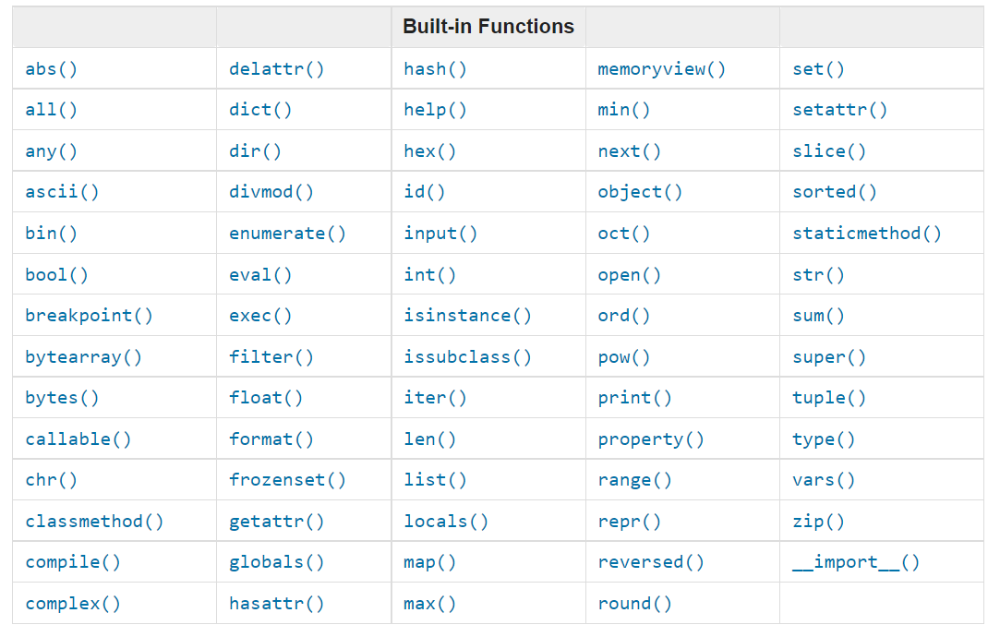

<!-- Designer README: High-impact, polished, and engaging -->

<p align="center">
  
</p>

<h1 align="center">✨ Python Learning Journey — Code Lab & Portfolio</h1>

<p align="center">A visual, hands-on roadmap to learn Python step-by-step — perfect for practice, teaching, and showcasing your progress.</p>

<p align="center">
  <a href="https://github.com/Adeelbn-devs/Python"></a>
  
  
  
</p>

---

## Table of Contents

- ✨ Highlights
- 📚 Who is this for
- 📂 Structure (Interactive map)
- 🚀 Quick Start
- 🔍 Showcase (Sample outputs)
- 🧭 How to learn with this repo
- 🤝 Contributing
- 🛠 Roadmap & Enhancements
- 📬 Contact

---

## ✨ Highlights

- Micro-lessons with runnable examples — each folder is one focused topic.
- Attention to readability: clear filenames, descriptive prints, and example outputs.
- Designed for incremental learning: practice, tweak, and commit daily.
- Ready to fork for teaching, interview prep, or portfolio demos.

---

## 📚 Who is this for

- Absolute beginners who want guided practice.
- Developers revisiting fundamentals with hands-on examples.
- Students who prefer reading code + running examples.

---

## 📂 Structure (Interactive map)

Open a section to jump in (Windows path links for local convenience):

- [01_Introduction](</C:/Users/ADIL B N/OneDrive/Documents/GitHub/Python.worktrees/review-text-accuracy/01_Introduction>) — Setup, print, comments
- [02_Day_Variables_builtin_functions](</C:/Users/ADIL B N/OneDrive/Documents/GitHub/Python.worktrees/review-text-accuracy/02_Day_Variables_builtin_functions>) — Types, variables, casting
- [03_Operators](</C:/Users/ADIL B N/OneDrive/Documents/GitHub/Python.worktrees/review-text-accuracy/03_Operators>) — Math, logic, comparisons
- [04_Strings](</C:/Users/ADIL B N/OneDrive/Documents/GitHub/Python.worktrees/review-text-accuracy/04_Strings>) — Methods, formatting, slicing
- [05_Lists](</C:/Users/ADIL B N/OneDrive/Documents/GitHub/Python.worktrees/review-text-accuracy/05_Lists>) — Lists, methods, manipulation

> Tip: Each folder contains one or more scripts named to describe the lesson. Run them to see live outputs.

---

## 🚀 Quick Start — Run a sample in 60s

1. Open this folder in VS Code (or your terminal).
2. Use Python 3.8+ (virtualenv optional):

   ```powershell
   python -m venv .venv
   .\.venv\Scripts\activate
   ```

3. Run the hello script:

   ```powershell
   python .\01_Introduction\01_hello.py
   ```

4. See output, open the file, and experiment: change a value, re-run, commit. Small steps = big progress.

---

## 🔍 Showcase — sample snippets & outputs

Here are a few curated outputs you’ll see when running scripts in this repo:

- Hello & Intro:

```txt
Hello, Python Learning Journey Begins!
Hello world!
```

- Data types snapshot:

```txt
<class 'int'>
<class 'float'>
<class 'complex'>
<class 'str'>
<class 'list'>
```

- Math & geometry quick demo:

```txt
Triangle Area: 100.0
Circle Area: 314.0 | Circumference: 62.8
```

These small readable outputs make it easy to verify and play with examples.

---

## 🧭 How to learn with this repo — a designer’s workflow

1. Pick a lesson folder. Read the file names and README (if present).
2. Run the script to see the output.
3. Make one small change (input value, print, or variable) and re-run.
4. Commit the change with a clear message: "tweak: <lesson> — small change".
5. Keep a weekly goal (e.g., 3 lessons per week) and track progress using commits.

Design tip: Use VS Code split view — file on the left, terminal on the right. Experiment fast.

---

## 🤝 Contributing

Thanks for caring! Even though this started as a personal learning repo, contributions are welcome.

- Typos & copy: Open an issue or PR.
- Lesson improvements: Add clearer comments, edge-case examples, or small tests.
- New lesson: Add under `14_Mini_Projects/` with README and run instructions.

Contribution etiquette:

- Keep PRs focused and small.
- Add a short demo output in the PR description.

---

## 🛠 Roadmap & Enhancements

Planned improvements to make the repo feel even more polished:

- requirements.txt for reproducible environments
- Unit tests for core exercises (pytest)
- GitHub Actions to run smoke tests on push
- Visual GIF demos in /images for tricky lessons
- A minimal website (GitHub Pages) to showcase top lessons

---

## 📬 Contact

Maintainer: Adeel B N — passionate about learning and building.

- GitHub: https://github.com/Adeelbn-devs/Python
- Email: add-your-email@example.com

---

<p align="center" style="margin-top:20px">Designed with ♥ for learning. Fork, play, and build something cool.</p>
